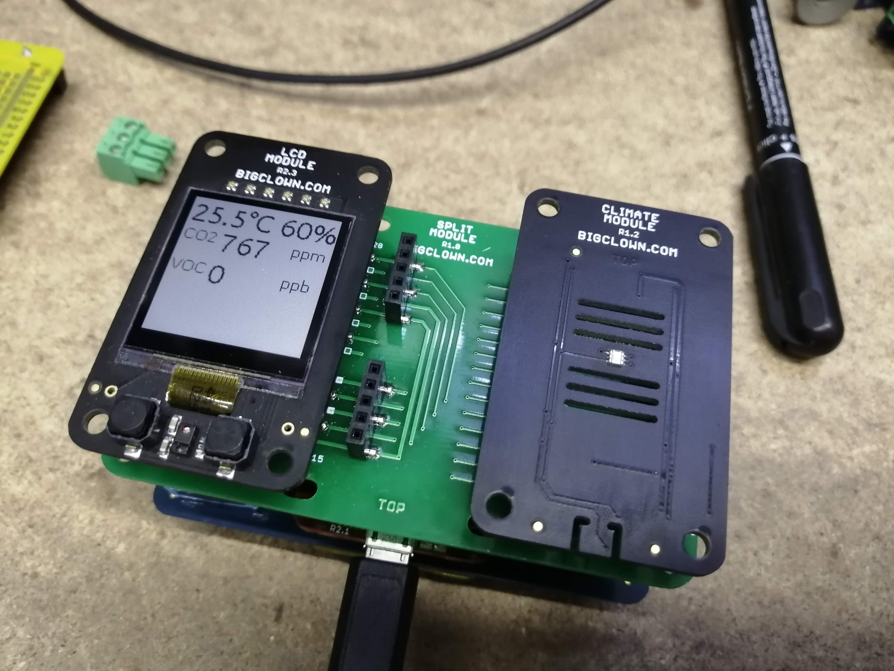

# Temperature, Humidity, CO2 and VOC-LP tag radio sensor with LCD Display

This repository contains firmware skeleton for [Core Module](https://shop.bigclown.com/core-module).

If you want to get more information about Core Module, firmware and how to work with it, please follow this link:

**https://www.bigclown.com/doc/firmware/basic-overview/**

User's application code (business logic) goes into `app/application.c`.
The default content works as a *Hello World* example.
When flashed into Core Module, it toggles LED state with each button press.

## License

This project is licensed under the [MIT License](https://opensource.org/licenses/MIT/) - see the [LICENSE](LICENSE) file for details.

---

Made with &#x2764;&nbsp; by [**HARDWARIO s.r.o.**](https://www.hardwario.com/) in the heart of Europe.
